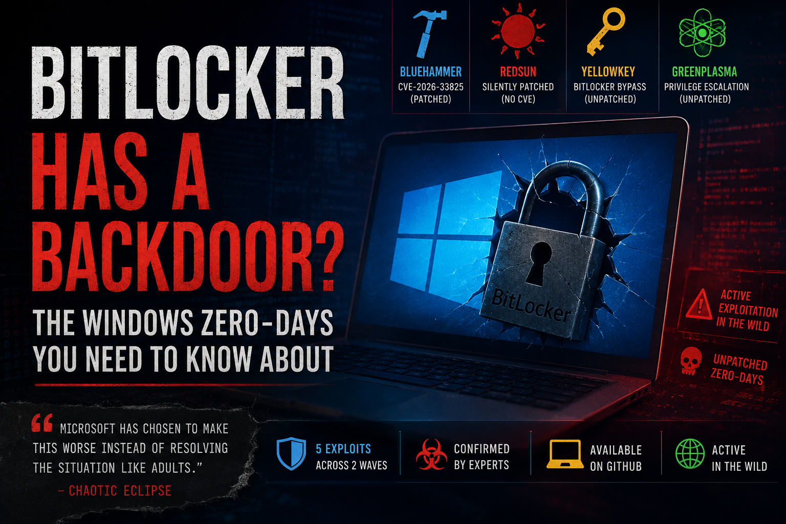

> **TL;DR:** A disgruntled security researcher has publicly released unpatched exploits for BitLocker and Windows privilege escalation: and experts have confirmed they work.

---

## The Researcher Who Declared War on Microsoft

In the spring of 2026, an anonymous cybersecurity researcher known as **Chaotic Eclipse** (also [Nightmare-Eclipse on GitHub](https://github.com/Nightmare-Eclipse)) began publishing a series of zero-day exploits targeting Windows: not to fame, not for profit, but out of **frustration**.

The story is a familiar one in the security world: researcher finds a serious bug, reports it responsibly, and the vendor either doesn't pay, doesn't respond, or patches it silently without acknowledgment. In this case, Chaotic Eclipse alleges Microsoft's [Security Response Center (MSRC)](https://www.microsoft.com/en-us/msrc) did exactly that: and decided to publish the exploits publicly in retaliation.

"Microsoft has chosen to make this worse instead of resolving the situation like adults," the researcher wrote. "The fire will go as long as you want, unless you extinguish it or until there's nothing left to burn."

---

## The Arsenal: What Was Released

Chaotic Eclipse has now released **five exploits in total**, across two waves. Here's what each one does:

### 🔨 BlueHammer: `CVE-2026-33825` *(Patched April 14, 2026)*

BlueHammer abuses Microsoft Defender's own signature update process. By chaining together **Volume Shadow Copy Service (VSS)**, the **Cloud Files API**, and **opportunistic locks**, it exploits a classic *time-of-check to time-of-use (TOCTOU) race condition*.

No kernel bugs. No memory corruption. No admin privileges required.

The end result? The Security Account Manager (SAM) database is leaked via a VSS snapshot, NTLM password hashes are extracted, a local administrator account is hijacked, and a **SYSTEM-level shell** is spawned: all while the original password hash is quietly restored to dodge detection.

BlueHammer was [officially patched by Microsoft on April 14, 2026](https://msrc.microsoft.com/update-guide/vulnerability/CVE-2026-33825) and assigned CVE-2026-33825.

---

### ☀️ RedSun: *(Silently patched, no CVE assigned)*

RedSun exploits a logic flaw in **Windows Defender's file remediation path**. When Defender detects a cloud-tagged malicious file and attempts to restore it, it fails to validate whether the restoration path has been swapped out for a **junction point**. A standard user can redirect Defender's own write operation into the `System32` directory: one of the most privileged locations on the entire OS.

Microsoft appears to have patched this without issuing any advisory or CVE identifier, which Chaotic Eclipse publicly criticized.

---

### 🔑 YellowKey: **UNPATCHED** *(BitLocker Bypass)*

This is the one that raised the most eyebrows.

YellowKey affects **Windows 11** and **Windows Server 2022/2025**. The exploit works by placing specially crafted **`FsTx` files** onto a USB drive or the EFI partition, rebooting the target machine into the **Windows Recovery Environment (WinRE)**, and pressing `CTRL` to trigger a shell: with the BitLocker-protected volume already unlocked.

Independent researcher **Will Dormann** (Tharros Labs) [confirmed the exploit on Mastodon](https://infosec.exchange/@wdormann):

> "It looks like Transactional NTFS bits on a USB drive are able to delete the `winpeshl.ini` file on another drive. We get a `cmd.exe` prompt, with BitLocker unlocked instead of the expected Windows Recovery environment."

Security researcher **Kevin Beaumont** also [independently confirmed](https://doublepulsar.com/) that the YellowKey exploit is valid and agreed that BitLocker appears to have a backdoor, recommending a BitLocker PIN and BIOS password as immediate mitigations.

What makes this particularly alarming is the debugging feature at the heart of it. The vulnerable component exists **only inside WinRE** and has almost no public documentation: which is precisely why the researcher believes it may be an **intentional backdoor**.

#### Key facts:
- Requires **physical access** to the target machine
- Works against **TPM-only** BitLocker (no PIN)
- Does **not** work against stolen drives (TPM keys stay on the original hardware)
- Chaotic Eclipse claims a **TPM + PIN** variant exists but has not released it

Full technical reporting on YellowKey from [BleepingComputer](https://www.bleepingcomputer.com/news/security/windows-bitlocker-zero-day-gives-access-to-protected-drives-poc-released/) and [The Hacker News](https://thehackernews.com/2026/05/windows-zero-days-expose-bitlocker.html).

---

### 🟢 GreenPlasma: **UNPATCHED** *(Privilege Escalation)*

GreenPlasma targets **Windows CTFMON** (Collaborative Translation Framework Monitor) through what the researcher calls an "arbitrary section creation" vulnerability.

An unprivileged user can create memory section objects inside directory paths writable only by SYSTEM, potentially manipulating kernel-mode drivers or privileged services that implicitly trust those locations.

The released proof-of-concept is **intentionally incomplete**: it doesn't deliver a full SYSTEM shell out of the box. Chaotic Eclipse noted this was deliberate, making it harder for Microsoft to reproduce and patch while still demonstrating the vulnerability is real.

---

## Why This Matters: The Bug Bounty Problem

Microsoft's **Security Response Center** offers [bug bounties ranging from $250 to $60,000+](https://www.microsoft.com/en-us/msrc/bounty) depending on severity and product. The system is designed to incentivize responsible disclosure: researchers find bugs, report privately, receive payment, and the vendor patches before the public knows.

But the entire model rests on **trust**. The researcher has to trust the vendor will reproduce, acknowledge, and pay. The vendor has to trust the disclosure is genuine.

When that trust breaks down: as Chaotic Eclipse alleges it did: the consequences are now playing out in real time: unpatched exploits on public GitHub repos, active exploitation in the wild, and a researcher promising *more* to come.

> "Next Patch Tuesday will have a big surprise for you, Microsoft. And remember, I never failed to deliver a promise."

---

## Active Exploitation in the Wild

Cybersecurity firm **[Huntress](https://www.huntress.com/)** has reported that the earlier exploits (BlueHammer and RedSun) are already being actively used by threat actors. Within **24 hours** of YellowKey and GreenPlasma being published, they too appeared in active attack campaigns, as reported by [Forbes](https://www.forbes.com/sites/daveywinder/2026/05/14/microsoft-windows-alert-angry-hacker-drops-2-new-zero-day-exploits/).

The barrier to entry is low. These aren't sophisticated nation-state tools: they're published on **[GitHub](https://github.com/Nightmare-Eclipse)**, which Microsoft happens to own.

---

## The BitLocker Downgrade Problem (A Separate But Related Issue)

Separately, French cybersecurity firm **[Intrinsec](https://www.intrinsec.com/)** disclosed an attack chain against BitLocker leveraging a boot manager downgrade via **[CVE-2025-48804](https://msrc.microsoft.com/update-guide/vulnerability/CVE-2025-48804)**. The technique bypasses encryption on fully patched Windows 11 systems in under **five minutes** by exploiting the fact that **Secure Boot validates signing certificates, not binary versions**.

This means an older, vulnerable (but validly signed) boot manager can still be loaded. Microsoft plans to retire the old **PCA 2011 certificates** in June 2026, which should close this particular gap: but only if organizations revoke the old certificates promptly.

---

## What You Should Do Right Now

| Action | Addresses | Details & Links |
|--------|-----------|-----------------|
| **Enable BitLocker with TPM + PIN (pre-boot authentication)** | YellowKey (current public PoC) | Strongly recommended. The released PoC primarily targets TPM-only configurations. A strong PIN adds a significant barrier. Check with: `manage-bde -protectors -get C:` |
| **Set a strong BIOS/UEFI firmware password + disable USB boot / lock boot order** | YellowKey physical access | Raises the bar for booting modified WinRE or USB-based attacks. Recommended by multiple researchers (e.g., Kevin Beaumont). |
| **Apply latest Windows + Defender updates** | BlueHammer (CVE-2026-33825) and other issues | BlueHammer was patched in the April 2026 Patch Tuesday. Ensure the latest Defender Antimalware Platform update is installed. [Microsoft Security Update Guide](https://msrc.microsoft.com/update-guide/) |
| **Disable Windows Recovery Environment (WinRE) where feasible** | YellowKey (strongest technical mitigation) | Removes the primary attack surface. Use `reagentc /disable`. Trade-off: loses built-in recovery features. Best for high-security or centrally managed devices. Re-enable with `reagentc /enable` when needed. |
| **Migrate to Windows UEFI CA 2023 certificate** | Older boot/Secure Boot downgrade attacks (e.g., CVE-2025-48804 / BitUnlocker) | Good general hygiene but **does not mitigate** the current YellowKey exploit. [Microsoft Guidance on Secure Boot CA 2023](https://support.microsoft.com/en-us/topic/windows-secure-boot-certificate-expiration-and-ca-updates-7ff40d33-95dc-4c3c-8725-a9b95457578e) |
| **Audit and restrict physical access to devices** | All local/physical exploits (YellowKey, etc.) | Especially important for laptops. Use full shutdowns (not sleep/hibernation) when leaving devices unattended. |
| **Consider alternatives for sensitive data** | Long-term proprietary encryption concerns | Use VeraCrypt containers or full-disk encryption (LUKS on Linux) for high-value data. [Cryptsetup (LUKS)](https://gitlab.com/cryptsetup/cryptsetup) |

---

## The Bigger Picture

There is a legitimate philosophical debate embedded in all of this. Proprietary full-disk encryption is, by nature, a black box. You trust that the vendor built it correctly, that no debugging features were left in production code, and that no three-letter agency has a quiet line to the recovery keys.

YellowKey doesn't prove a backdoor exists. But an undocumented debugging hook inside the Windows Recovery Environment: one that bypasses full-disk encryption: is exactly the kind of thing that *should* have documentation, and the absence of it is at minimum a serious oversight.

Whether this is negligence or intent, the practical takeaway is the same: **if encryption matters to you, verify it**. Don't assume a locked drive is an inaccessible one.

---

*Sources: [BleepingComputer](https://www.bleepingcomputer.com/news/security/windows-bitlocker-zero-day-gives-access-to-protected-drives-poc-released/) · [The Hacker News](https://thehackernews.com/2026/05/windows-zero-days-expose-bitlocker.html) · [Forbes](https://www.forbes.com/sites/daveywinder/2026/05/14/microsoft-windows-alert-angry-hacker-drops-2-new-zero-day-exploits/): May 13–14, 2026*